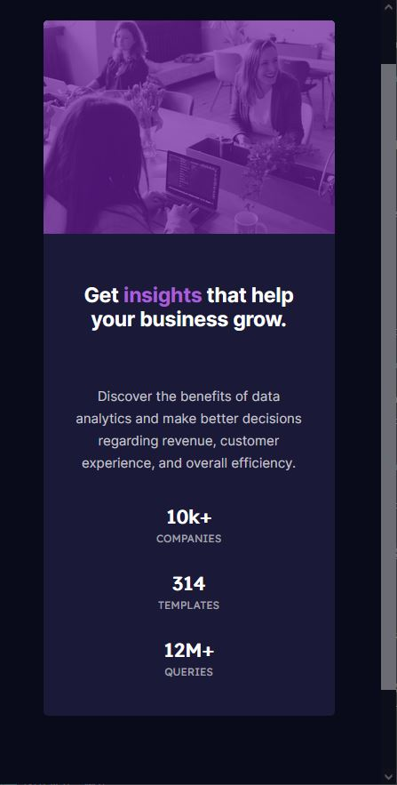
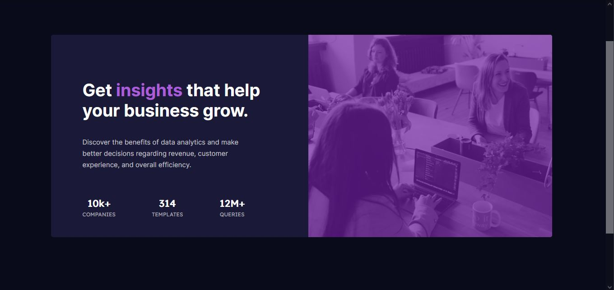

# Day10

_Creación de una imagen con el resumen de estadísticas y su imagen respectiva

## Desarrollado utilizando la metodología Mobile First
_Utilización de medias querie la cual permite obtener una vista responsive la cual se adapta a dispositivos móviles tabletas etc.

_Para la distribución del contenido dentro de la tarjeta se utilizó Flex Box

## Comenzando 🚀

_Mediante las siguientes instrucciones puedes tener acceso al reto, funciona en cualquier maquina y dispositivo móvil

### Pre-requisitos 📋
### Requisitos 📋
_Computadora sea de escritorio o portátil, así como también dispositivos móviles que tengan acceso a internet

## Ejecutando las pruebas ⚙️

_Abrir cualquier navegador y ingresar la siguiente url:
https://dyegho.github.io/day01/preview-card.html

## Capturas de pantalla
# Mobile

# Desktop

# Desarrollador ⚙️
    
    _Diego Pitizaca 
    
## Agradecimientos
* Fronted Club (100DaysOfProject)
* Frontend Challenge

_Los cuales me han exigido un estudio diferente en la manera de diseñar un componente web incrementando día a día mi pasión por el diseño y apegamiento a las exigencias de la actualidad en el campo del desarrollo WEB.
